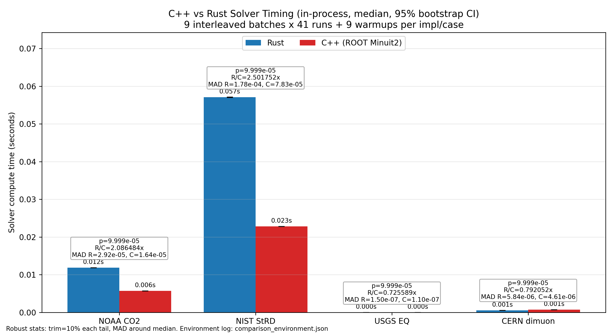

# minuit2-rs

[](https://github.com/ricardofrantz/minuit2-rs/actions/workflows/ci.yml)
[](https://crates.io/crates/minuit2)
[](https://docs.rs/minuit2)

Pure Rust port of [CERN Minuit2](https://github.com/root-project/root/tree/master/math/minuit2) — the standard parameter optimization engine for high-energy physics since 1975.

**Zero unsafe. Zero C++ dependencies. Drop-in for scientific workflows.**

## Table of Contents

- [Features](#features)
- [Quick Start](#quick-start)
- [Minimizers](#minimizers)
  - [MnMigrad (Variable Metric)](#mnmigrad-variable-metric)
  - [MnSimplex (Derivative-Free)](#mnsimplex-derivative-free)
  - [MnMinimize (Combined Strategy)](#mnminimize-combined-strategy)
- [Analytical Gradients](#analytical-gradients)
- [Error Analysis](#error-analysis)
  - [MnHesse (Exact Covariance)](#mnhesse-exact-covariance)
  - [MnMinos (Asymmetric Errors)](#mnminos-asymmetric-errors)
  - [MnScan (1D Parameter Scans)](#mnscan-1d-parameter-scans)
  - [MnContours (2D Confidence Regions)](#mncontours-2d-confidence-regions)
- [Parameter Configuration](#parameter-configuration)
- [Strategy Guide: Which Minimizer to Use](#strategy-guide-which-minimizer-to-use)
- [Real-World Examples](#real-world-examples)
  - [Chi-Square Fit](#chi-square-fit)
  - [Gaussian Peak Fit](#gaussian-peak-fit)
- [Python Bindings](#python-bindings)
- [Parallel Processing](#parallel-processing)
- [Feature Flags](#feature-flags)
- [The FCN Trait](#the-fcn-trait)
- [Working with Results](#working-with-results)
- [Algorithm Details](#algorithm-details)
- [Numerical Stability and Robustness](#numerical-stability-and-robustness)
- [Architecture: Differences from C++ Minuit2](#architecture-differences-from-c-minuit2)
- [Migration from iminuit (Python)](#migration-from-iminuit-python)
- [Benchmark Results](#benchmark-results)
- [Status](#status)
- [Verification (ROOT Parity)](#verification-root-parity)
- [License](#license)

---

## Features

- **Pure Rust.** No C++ toolchain, no unsafe blocks, zero-cost abstractions. Compiles on all tier-1 Rust targets (Linux, macOS, Windows).
- **Robust Algorithms.** Migrad (Variable Metric / DFP), Simplex (Nelder-Mead with rho-extrapolation), Hesse (exact Hessian), Minos (asymmetric errors via likelihood contour walking), Scan (1D profiles), Contours (2D confidence regions).
- **Analytical Gradients.** User-provided gradients via the `FCNGradient` trait for faster convergence and reduced function evaluations, especially in high-dimensional problems.
- **Python Bindings.** High-performance [PyO3](https://pyo3.rs/) bindings with an iminuit-compatible API. Build with [maturin](https://www.maturin.rs/).
- **Parallel Processing.** Optional [`rayon`](https://docs.rs/rayon) support for parallel 1D parameter scans.
- **Numerical Stability.** NaN/Inf resilience with automatic recovery — FCN returns of NaN or Infinity are treated as large penalties, preventing optimizer crashes. Non-positive-definite covariance matrices are automatically corrected via eigenvalue shift.
- **Verified against ROOT.** Differential testing against ROOT `v6-36-08` with 12 workloads, 415 traced symbols, and automated CI gates.

---

## Quick Start

Add to your `Cargo.toml`:

```toml
[dependencies]
minuit2 = "0.4"
```

Minimize the Rosenbrock function:

```rust
use minuit2::MnMigrad;

let result = MnMigrad::new()
    .add("x", 0.0, 0.1)
    .add("y", 0.0, 0.1)
    .minimize(&|p: &[f64]| {
        (1.0 - p[0]).powi(2) + 100.0 * (p[1] - p[0] * p[0]).powi(2)
    });

println!("{result}");
// Output includes: fval, EDM, nfcn, parameter values and errors, validity
```

The `minimize` method accepts any `&impl FCN`, including closures. Parameters are accessed by index in the closure (same order as `.add()` calls). The `Display` implementation prints a formatted summary including the function value, EDM, number of function calls, and all parameter values with their errors.

---

## Minimizers

### MnMigrad (Variable Metric)

The primary workhorse. Uses a quasi-Newton method with the Davidon-Fletcher-Powell (DFP) rank-2 update of the approximate inverse Hessian. This is the same algorithm used in Fortran MINUIT since 1975 and in ROOT's C++ Minuit2.

- **Convergence:** Quadratic near the minimum — typically the fastest for smooth, well-behaved functions.
- **Output:** Approximate covariance matrix at the minimum (can be improved to exact by running Hesse afterwards).
- **Use case:** Chi-square fits, maximum likelihood estimation, any smooth objective function.
- **Not recommended for:** Discontinuous or very noisy functions — use Simplex instead.

```rust
use minuit2::MnMigrad;

let result = MnMigrad::new()
    .add("x", 5.0, 0.1)
    .add_limited("y", 0.0, 0.1, -10.0, 10.0)  // bounded parameter
    .with_strategy(2)   // high accuracy (more gradient evaluations)
    .tolerance(0.01)    // tighter EDM convergence
    .max_fcn(10000)     // function call limit
    .minimize(&|p: &[f64]| p[0] * p[0] + p[1] * p[1]);

assert!(result.is_valid());
let state = result.user_state();
println!("x = {:.4} +/- {:.4}", state.value("x").unwrap(), state.error("x").unwrap());
println!("y = {:.4} +/- {:.4}", state.value("y").unwrap(), state.error("y").unwrap());
```

**Strategy levels:**
- `0` — Low: fewest gradient evaluations, fastest, least precise.
- `1` — Medium (default): good balance of speed and accuracy.
- `2` — High: extra gradient evaluations for better precision, recommended for publication-quality results.

### MnSimplex (Derivative-Free)

Uses the Nelder-Mead simplex algorithm in the Minuit variant, which includes rho-extrapolation from the original Fortran MINUIT. This is *not* textbook Nelder-Mead — it lacks the shrink step and uses a centroid-based final evaluation.

- **Robustness:** Very high. Can navigate non-smooth, noisy, or discontinuous landscapes.
- **Performance:** Slower than Migrad for smooth functions (linear convergence vs. quadratic).
- **Covariance:** Does *not* produce a covariance matrix. Run Hesse afterwards if you need errors.
- **Use case:** Rugged landscapes (e.g., Goldstein-Price), noisy data, or as a pre-minimizer to get Migrad started from a better region.

```rust
use minuit2::MnSimplex;

let result = MnSimplex::new()
    .add("x", 5.0, 1.0)
    .add("y", 5.0, 1.0)
    .minimize(&|p: &[f64]| {
        // Goldstein-Price function — a classic test with multiple local minima
        let (x, y) = (p[0], p[1]);
        let a = 1.0 + (x + y + 1.0).powi(2)
            * (19.0 - 14.0*x + 3.0*x*x - 14.0*y + 6.0*x*y + 3.0*y*y);
        let b = 30.0 + (2.0*x - 3.0*y).powi(2)
            * (18.0 - 32.0*x + 12.0*x*x + 48.0*y - 36.0*x*y + 27.0*y*y);
        a * b
    });

println!("Simplex found minimum: fval = {:.6}", result.fval());
```

### MnMinimize (Combined Strategy)

Runs Simplex first to find a good starting region (robust global exploration), then refines with Migrad (fast local convergence). This is the recommended approach when you're unsure about the starting point or the landscape is complicated.

```rust
use minuit2::MnMinimize;

let result = MnMinimize::new()
    .add("x", 10.0, 1.0)
    .add("y", 10.0, 1.0)
    .minimize(&|p: &[f64]| (p[0] - 3.0).powi(2) + (p[1] + 1.0).powi(2));

assert!(result.is_valid());
```

The Simplex phase uses a configurable fraction of the total function call budget before handing off to Migrad for the final refinement.

---

## Analytical Gradients

By default, Migrad uses 2-point central-difference numerical differentiation to approximate the gradient. For performance-critical or high-dimensional problems, you can provide analytical derivatives by implementing the `FCNGradient` trait.

```rust
use minuit2::{FCN, FCNGradient, MnMigrad};

struct Rosenbrock;

impl FCN for Rosenbrock {
    fn value(&self, p: &[f64]) -> f64 {
        (1.0 - p[0]).powi(2) + 100.0 * (p[1] - p[0] * p[0]).powi(2)
    }
}

impl FCNGradient for Rosenbrock {
    fn gradient(&self, p: &[f64]) -> Vec<f64> {
        let dx = -2.0 * (1.0 - p[0]) - 400.0 * p[0] * (p[1] - p[0] * p[0]);
        let dy = 200.0 * (p[1] - p[0] * p[0]);
        vec![dx, dy]
    }
}

let result = MnMigrad::new()
    .add("x", -1.0, 0.1)
    .add("y", -1.0, 0.1)
    .minimize_grad(&Rosenbrock);

assert!(result.is_valid());
```

**When to use analytical gradients:**
- High-dimensional problems (>10 parameters): saves 2*N function evaluations per gradient.
- Steep valleys where numerical step sizes may overshoot or undershoot.
- When the gradient is cheap to compute relative to the function (e.g., auto-differentiation).
- When you need maximum precision in the gradient for reliable Hessian estimation.

**When numerical gradients are fine:**
- Low-dimensional problems (2-5 parameters): the overhead is minimal.
- Prototyping: closures with numerical gradients are simpler to write.
- When analytical derivatives are error-prone or tedious to derive.

---

## Error Analysis

### MnHesse (Exact Covariance)

Computes the full Hessian matrix at the minimum using finite differences, yielding exact (parabolic) parameter errors, correlations, and the global correlation coefficients. Always run Hesse after Migrad if you need reliable error estimates — Migrad's covariance is only approximate.

```rust
use minuit2::{MnMigrad, MnHesse};

let fcn = |p: &[f64]| p[0] * p[0] + 4.0 * p[1] * p[1] + 2.0 * p[0] * p[1];

let min = MnMigrad::new()
    .add("x", 5.0, 0.1)
    .add("y", 5.0, 0.1)
    .minimize(&fcn);

let min = MnHesse::new()
    .with_strategy(2)  // high-accuracy Hessian
    .calculate(&fcn, &min);

let state = min.user_state();
println!("x = {:.4} +/- {:.4}", state.value("x").unwrap(), state.error("x").unwrap());
println!("y = {:.4} +/- {:.4}", state.value("y").unwrap(), state.error("y").unwrap());

// Access the full covariance matrix
if let Some(cov) = state.covariance() {
    println!("Cov(x,x) = {:.6}", cov.get(0, 0));
    println!("Cov(x,y) = {:.6}", cov.get(0, 1));
    println!("Cov(y,y) = {:.6}", cov.get(1, 1));
}

// Global correlation coefficients
if let Some(gcc) = state.global_cc() {
    println!("Global CC: {:?}", gcc);
}
```

### MnMinos (Asymmetric Errors)

Finds the true likelihood contour (or chi-square contour) for each parameter by walking along the function until `f(x) = f_min + UP`, where `UP` is the error definition (1.0 for chi-square, 0.5 for negative log-likelihood). This gives asymmetric error bars that are accurate even for non-parabolic minima.

```rust
use minuit2::{MnMigrad, MnHesse, MnMinos};

let fcn = |p: &[f64]| p[0] * p[0];

let min = MnMigrad::new()
    .add("x", 5.0, 0.1)
    .minimize(&fcn);

let min = MnHesse::new().calculate(&fcn, &min);

let minos = MnMinos::new(&fcn, &min);
let err = minos.minos_error(0);  // parameter index 0

if err.is_valid() {
    println!("x = {:.4}  {:.4} / +{:.4}",
        min.user_state().value("x").unwrap(),
        err.lower_error(),   // negative (e.g., -1.0)
        err.upper_error());  // positive (e.g., +1.0)
}
```

**Important:** Always run Hesse before Minos. Minos uses the Hessian covariance as a starting point for its contour walk, and will give poor results (or fail) without it.

### MnScan (1D Parameter Scans)

Scans a single parameter over a range while minimizing over all other parameters. Useful for visualizing chi-square profiles or likelihood profiles.

```rust
use minuit2::{MnMigrad, MnScan};

let fcn = |p: &[f64]| (p[0] - 3.0).powi(2) + (p[1] + 1.0).powi(2);

let min = MnMigrad::new()
    .add("x", 0.0, 0.1)
    .add("y", 0.0, 0.1)
    .minimize(&fcn);

let scan = MnScan::new(&fcn, &min);

// Scan parameter 0 ("x") with 50 points from -5 to 10
let points: Vec<(f64, f64)> = scan.scan(0, 50, -5.0, 10.0);

// Auto-range: pass (0.0, 0.0) to scan +/- 2*sigma around the minimum
let auto_points = scan.scan(0, 20, 0.0, 0.0);

for (x_val, f_val) in &points {
    println!("x = {:.4}, f = {:.4}", x_val, f_val);
}
```

### MnContours (2D Confidence Regions)

Computes 2D confidence contours for pairs of parameters at the `f_min + UP` level. Returns a set of (x, y) points tracing the contour.

```rust
use minuit2::{MnMigrad, MnHesse, MnContours};

let fcn = |p: &[f64]| p[0] * p[0] + p[1] * p[1] + 0.5 * p[0] * p[1];

let min = MnMigrad::new()
    .add("x", 5.0, 0.1)
    .add("y", 5.0, 0.1)
    .minimize(&fcn);

let min = MnHesse::new().calculate(&fcn, &min);

let contours = MnContours::new(&fcn, &min);

// Compute 20 points on the 1-sigma contour for parameters 0 and 1
let points: Vec<(f64, f64)> = contours.points(0, 1, 20);

for (x, y) in &points {
    println!("({:.4}, {:.4})", x, y);
}
```

---

## Parameter Configuration

Parameters support several constraint modes:

```rust
use minuit2::MnMigrad;

let result = MnMigrad::new()
    // Unbounded parameter: name, initial value, initial step size (error estimate)
    .add("amplitude", 10.0, 1.0)

    // Double-bounded: constrained to [lower, upper]
    .add_limited("phase", 0.0, 0.1, -3.14159, 3.14159)

    // Lower-bounded only: constrained to [lower, +inf)
    .add_lower_limited("sigma", 1.0, 0.1, 0.001)

    // Upper-bounded only: constrained to (-inf, upper]
    .add_upper_limited("offset", 0.0, 0.1, 100.0)

    // Fixed (constant): not optimized, but available in the FCN parameter array
    .add_const("scale", 42.0)

    .minimize(&|p: &[f64]| {
        // p[0] = amplitude, p[1] = phase, p[2] = sigma, p[3] = offset, p[4] = scale
        p[0] * p[0] + p[1] * p[1] + p[2] * p[2] + p[3] * p[3]
    });
```

**Notes on parameter ordering:**
- Parameters appear in the `p: &[f64]` array in the order they are added.
- Fixed parameters occupy a slot in the array but are not varied by the optimizer.
- The initial step size (second numeric argument in `.add()`) is critical: too large and the optimizer may overshoot, too small and it will converge slowly. A good rule of thumb is ~10% of the expected parameter range.

**Notes on bounds:**
- Bounded parameters use internal transformations (sin, sqrt) to map between the bounded external space and the unbounded internal optimization space. This means the optimizer always works in unbounded space, ensuring smooth derivatives.
- Avoid setting bounds exactly at parameter values — this can cause the transform Jacobian to become singular. Leave a small margin.

---

## Strategy Guide: Which Minimizer to Use

| Scenario | Recommended Approach | Why |
|----------|---------------------|-----|
| Smooth chi-square/likelihood fit | `MnMigrad` | Quadratic convergence, produces covariance |
| Unknown landscape, bad starting point | `MnMinimize` (Simplex + Migrad) | Simplex finds the basin, Migrad refines |
| Noisy or discontinuous function | `MnSimplex` | No derivatives needed, very robust |
| High-dimensional (>20 params) | `MnMigrad` + analytical gradients | Saves 2N evaluations per gradient step |
| Need asymmetric errors | `MnMigrad` → `MnHesse` → `MnMinos` | Full error pipeline |
| Need exact parabolic errors | `MnMigrad` → `MnHesse` | Hesse gives exact Hessian-based errors |
| Quick parameter profile | `MnMigrad` → `MnScan` | Fast 1D visualization |
| 2D confidence ellipse | `MnMigrad` → `MnHesse` → `MnContours` | Contour at f_min + UP |

**Typical workflow for a physics fit:**

```rust
use minuit2::{FCN, MnMigrad, MnHesse, MnMinos};

// 1. Define your FCN (chi-square or negative log-likelihood)
let fcn = |p: &[f64]| { /* your objective function */ 0.0 };

// 2. Run Migrad to find the minimum
let min = MnMigrad::new()
    .add("param1", initial1, step1)
    .add("param2", initial2, step2)
    .minimize(&fcn);

// 3. Check validity
assert!(min.is_valid(), "Migrad did not converge!");

// 4. Run Hesse for exact errors
let min = MnHesse::new().calculate(&fcn, &min);

// 5. (Optional) Run Minos for asymmetric errors
let minos = MnMinos::new(&fcn, &min);
let err0 = minos.minos_error(0);
let err1 = minos.minos_error(1);
```

---

## Real-World Examples

Scientific demo cases with per-case README/run scripts live in `examples/`:
`examples/noaa_co2`, `examples/nist_strd`, `examples/usgs_earthquakes`, `examples/cern_dimuon`.

Aggregate C++ vs Rust solver timing (auto-regenerated by workflow):



### Chi-Square Fit

Fit a quadratic polynomial `y = c0 + c1*x + c2*x^2` to data with known uncertainties:

```rust
use minuit2::{FCN, MnMigrad, MnHesse, MnScan};

struct PolyChi2 {
    x: Vec<f64>,
    y: Vec<f64>,
    sigma: Vec<f64>,
}

impl FCN for PolyChi2 {
    fn value(&self, p: &[f64]) -> f64 {
        self.x.iter().zip(self.y.iter()).zip(self.sigma.iter())
            .map(|((&xi, &yi), &si)| {
                let model = p[0] + p[1] * xi + p[2] * xi * xi;
                ((yi - model) / si).powi(2)
            })
            .sum()
    }

    fn error_def(&self) -> f64 {
        1.0  // chi-square: UP = 1.0 for 1-sigma errors
    }
}

// ... set up data vectors ...

let fcn = PolyChi2 { x, y, sigma };

let result = MnMigrad::new()
    .add("c0", 1.0, 0.1)
    .add("c1", 0.3, 0.05)
    .add("c2", 0.05, 0.01)
    .minimize(&fcn);

let hesse = MnHesse::new().calculate(&fcn, &result);
let state = hesse.user_state();

let ndf = fcn.x.len() as f64 - 3.0;
println!("chi2/ndf = {:.2}/{:.0} = {:.2}", hesse.fval(), ndf, hesse.fval() / ndf);

// Scan c2 to visualize the chi-square profile
let scan = MnScan::new(&fcn, &hesse);
let profile = scan.scan(2, 20, 0.0, 0.0);  // auto-range
```

Run the full example: `cargo run --example chi_square`

### Gaussian Peak Fit

Fit a Gaussian `y = A * exp(-(x-mu)^2 / (2*sigma^2))` with Migrad + Hesse + Minos:

```rust
use minuit2::{FCN, MnMigrad, MnHesse, MnMinos};

struct GaussianChi2 {
    x: Vec<f64>,
    y: Vec<f64>,
    sigma: Vec<f64>,
}

impl FCN for GaussianChi2 {
    fn value(&self, p: &[f64]) -> f64 {
        let (amp, mu, sig) = (p[0], p[1], p[2]);
        self.x.iter().zip(self.y.iter()).zip(self.sigma.iter())
            .map(|((&xi, &yi), &si)| {
                let model = amp * (-0.5 * ((xi - mu) / sig).powi(2)).exp();
                ((yi - model) / si).powi(2)
            })
            .sum()
    }

    fn error_def(&self) -> f64 { 1.0 }
}

let result = MnMigrad::new()
    .add("A", 8.0, 1.0)
    .add("mu", 4.0, 0.5)
    .add_lower_limited("sigma", 2.0, 0.5, 0.01)  // sigma must be positive
    .minimize(&fcn);

let hesse = MnHesse::new().calculate(&fcn, &result);

// Minos for asymmetric errors on each parameter
let minos = MnMinos::new(&fcn, &hesse);
let names = ["A", "mu", "sigma"];
for (i, name) in names.iter().enumerate() {
    let me = minos.minos_error(i);
    if me.is_valid() {
        println!("{} = {:.4}  {:.4} / +{:.4}",
            name, hesse.user_state().value(name).unwrap(),
            me.lower_error(), me.upper_error());
    }
}
```

Run the full example: `cargo run --example gaussian_fit`

**More examples:** See the [`examples/`](examples/) directory for Rosenbrock, Rosenbrock with Hesse, and more.

---

## Python Bindings

Enabled with the `python` feature flag. Built with [PyO3](https://pyo3.rs/) (v0.28) and [maturin](https://www.maturin.rs/).

```python
from minuit2 import Minuit

# Define objective function — parameter names come from keyword arguments
def fcn(x, y):
    return (x - 1)**2 + (y - 2)**2

# Create Minuit object with initial values
m = Minuit(fcn, x=0, y=0)

# Run Migrad
m.migrad()
print(m.values)  # {'x': ~1.0, 'y': ~2.0}
print(m.errors)  # approximate errors
print(m.valid)   # True
print(m.fval)    # ~0.0

# Refine errors with Hesse
m.hesse()

# Get asymmetric errors with Minos
minos_errors = m.minos()
# Returns: {'x': {'lower': -1.0, 'upper': 1.0}, 'y': {'lower': -1.0, 'upper': 1.0}}

# Access covariance matrix
print(m.covariance)  # [[cov_xx, cov_xy], [cov_yx, cov_yy]]

# Global correlation coefficients
print(m.global_cc)

# Parameter scan
points = m.scan("x", nsteps=100, low=-5.0, high=5.0)

# 2D contour
contour_points = m.contour("x", "y", npoints=20)

# Set parameter limits
m.limits = {"x": (-10, 10), "y": None}  # None removes limits

# Fix parameters
m.fixed = ["y"]  # fix y at its current value

# Run Simplex instead
m.simplex()
```

**Building:**

```bash
# Using maturin
pip install maturin
maturin develop --features python

# Or build a wheel
maturin build --features python
```

---

## Parallel Processing

Enabled with the `parallel` feature flag. Uses [`rayon`](https://docs.rs/rayon) to parallelize 1D parameter scans across multiple CPU cores.

```toml
[dependencies]
minuit2 = { version = "0.4", features = ["parallel"] }
```

```rust
use minuit2::MnScan;

// After obtaining a minimum...
let scan = MnScan::new(&fcn, &min);

// Parallel scan: same API as scan(), but evaluates points in parallel
let points = scan.scan_parallel(0, 1000, -10.0, 10.0);
```

**Performance note:** Parallel scans have overhead from thread pool management. For small scans (<100 points) or very fast FCNs, the serial `scan()` may be faster. Parallel scans shine when the FCN is expensive (e.g., numerical integration, simulation) and the number of points is large.

---

## Feature Flags

| Flag | Default | Description |
|------|---------|-------------|
| `python` | off | PyO3 bindings — exposes `Minuit` class to Python |
| `parallel` | off | `rayon` support — enables `MnScan::scan_parallel` |

```toml
# Enable both features
[dependencies]
minuit2 = { version = "0.4", features = ["python", "parallel"] }
```

---

## The FCN Trait

All minimizers accept any type implementing the `FCN` trait. The simplest way is a closure:

```rust
// Closure — simplest for prototyping
let result = MnMigrad::new()
    .add("x", 0.0, 0.1)
    .minimize(&|p: &[f64]| p[0] * p[0]);
```

For more complex cases, implement `FCN` on a struct:

```rust
use minuit2::FCN;

struct MyModel {
    data: Vec<f64>,
    errors: Vec<f64>,
}

impl FCN for MyModel {
    fn value(&self, p: &[f64]) -> f64 {
        // Compute chi-square or negative log-likelihood
        self.data.iter().zip(self.errors.iter())
            .enumerate()
            .map(|(i, (&d, &e))| {
                let model = p[0] + p[1] * i as f64;
                ((d - model) / e).powi(2)
            })
            .sum()
    }

    /// Error definition: 1.0 for chi-square, 0.5 for negative log-likelihood.
    /// This affects the interpretation of Hesse errors and Minos contours.
    /// Default is 1.0.
    fn error_def(&self) -> f64 {
        1.0
    }
}
```

**Important:** The `error_def()` method controls how parameter errors are interpreted:
- `1.0` (default): appropriate for chi-square minimization. Hesse errors correspond to 1-sigma.
- `0.5`: appropriate for negative log-likelihood minimization.

---

## Working with Results

The `FunctionMinimum` returned by `minimize()` contains everything about the result:

```rust
let result = MnMigrad::new()
    .add("x", 5.0, 0.1)
    .add("y", 5.0, 0.1)
    .minimize(&|p: &[f64]| p[0] * p[0] + p[1] * p[1]);

// Check convergence
println!("Valid: {}", result.is_valid());
println!("Function value at minimum: {:.6}", result.fval());
println!("Estimated Distance to Minimum (EDM): {:.2e}", result.edm());
println!("Number of function calls: {}", result.nfcn());

// Access parameter values and errors through user_state
let state = result.user_state();

// By name
let x_val = state.value("x").unwrap();
let x_err = state.error("x").unwrap();

// Access the parameter transformation object for index-based access
let params = state.params();
println!("Number of parameters: {}", params.len());

// Covariance matrix (available after Hesse, approximate after Migrad)
if let Some(cov) = state.covariance() {
    println!("Covariance matrix dimensions: {}x{}", cov.nrow(), cov.ncol());
    println!("sigma_x = {:.4}", cov.get(0, 0).sqrt());
}

// Global correlation coefficients
if let Some(gcc) = state.global_cc() {
    println!("Global correlations: {:?}", gcc);
}

// Print everything at once
println!("{result}");
```

---

## Algorithm Details

### Davidon-Fletcher-Powell (DFP) — Migrad Core

The core of Migrad maintains an estimate of the inverse Hessian **V**. At each iteration:

1. **Gradient computation:** Compute grad(f) using 2-point central differences (or user-provided analytical gradient).
2. **Newton step:** Compute **dx** = -**V** * grad(f).
3. **Line search:** Parabolic line search along the Newton direction to find the step size that minimizes f.
4. **Variable metric update:** Update **V** using the DFP rank-2 formula:
   - **V_new** = **V** + (dx * dx^T) / (dx^T * dg) - (**V** * dg * dg^T * **V**) / (dg^T * **V** * dg)
   - Where dg = grad_new - grad_old
   - A hybrid correction is applied: if delgam > gvg (gradient-based criterion), a rank-1 BFGS-like correction is also added.
5. **Convergence check:** Stop when EDM = grad^T * **V** * grad < tolerance * UP * 0.002 (the 0.002 factor is an F77 compatibility constant from original MINUIT).
6. **Quality tracking:** The `dcovar` variable tracks the quality of the covariance estimate (0 = exact, 1 = fully recomputed). EDM is multiplied by (1 + 3*dcovar) to account for covariance uncertainty.

### Parameter Transformations

Bounded parameters are optimized in an unbounded internal space using differentiable transforms:

| Constraint | External → Internal | Properties |
|------------|-------------------|------------|
| Both bounds [a,b] | sin transform | Smooth, bounded derivative |
| Lower bound [a,+inf) | sqrt(x^2 + 1) - 1 + a | Monotonic, well-conditioned |
| Upper bound (-inf,b] | b - sqrt(x^2 + 1) + 1 | Monotonic, well-conditioned |

The MnFcn wrapper automatically transforms parameters from internal to external space before calling the user's FCN. The Jacobian of the transformation is used to convert gradients and covariance matrices between spaces.

### Simplex Algorithm (Minuit Variant)

The Minuit simplex is **not** textbook Nelder-Mead. Key differences:
- Uses rho-extrapolation from original Fortran MINUIT heritage.
- No shrink step — contraction failure breaks the loop instead.
- After the main loop, the centroid (pbar) is evaluated as a potential final point.
- Convergence requires both current and previous EDM to be below threshold (do-while pattern).

### Hesse Algorithm

Computes the full n×n Hessian matrix using central finite differences:
- H_ij = (f(x+ei+ej) - f(x+ei-ej) - f(x-ei+ej) + f(x-ei-ej)) / (4 * di * dj)
- Step sizes are determined by the strategy level.
- The resulting covariance matrix V = H^(-1) is checked for positive-definiteness and corrected via eigenvalue shift if needed.

### Minos Algorithm

For each parameter, Minos finds the points where f(x) = f_min + UP by:
1. Starting from the minimum with the Hesse covariance as initial step estimate.
2. Walking along the parameter while profiling (minimizing) over all other parameters.
3. Using parabolic interpolation (MnCross) to find the exact crossing point.
4. The asymmetric errors are: lower = x_crossing_low - x_min, upper = x_crossing_high - x_min.

---

## Numerical Stability and Robustness

`minuit2-rs` implements several safety layers to ensure reliability in scientific workflows:

1. **NaN/Inf Resilience:** If your FCN returns `NaN` or `Inf`, the optimizer treats it as a huge penalty value. This prevents the linear algebra core from collapsing and allows the minimizer to "back out" of illegal parameter regions.

2. **Positive-Definite Correction (MnPosDef):** If the covariance matrix becomes non-positive-definite (due to negative curvature, numerical precision loss, or a saddle point), the library automatically applies an eigenvalue shift to restore positive-definiteness. This tracks whether a diagonal shift was needed before the eigenvalue check.

3. **Safe Floating-Point Sorting:** All internal sorting operations (in LineSearch, Minos, and Simplex) use `total_cmp`-based NaN-safe comparisons to prevent panics during extreme numerical instability.

4. **Stress Testing:** The library is validated against:
   - The **Goldstein-Price** function (multiple local minima, steep gradients).
   - High-dimensional (**50D**) quadratic bowls.
   - Adversarial inputs (NaN/Inf FCN returns, degenerate starting points, boundary edge cases).

---

## Architecture: Differences from C++ Minuit2

This is a clean Rust rewrite, not a line-by-line translation. Key architectural differences:

| C++ Minuit2 | Rust minuit2-rs | Rationale |
|-------------|-----------------|-----------|
| 28 custom LA files (MnMatrix, LAVector, etc.) | `nalgebra` DVector/DMatrix | Battle-tested LA library, no maintenance burden |
| Smart pointers, BasicMinimumSeed/State pairs | Flat structs with ownership | Rust ownership model replaces refcounting |
| `MnFcn::operator()` | `FCN::value()` | Avoids Rust nightly `Fn::call()` name collision |
| `DavidonErrorUpdator` class hierarchy | Inline DFP update in builder.rs | Single algorithm, no need for trait dispatch |
| `MnPrint` logging subsystem | Rust `Display` trait on results | Idiomatic Rust formatting |
| Manual memory management | Automatic via ownership/borrowing | Zero-cost memory safety |
| ROOT framework integration | Standalone crate | No ROOT dependency, pure `cargo add` |

---

## Migration from iminuit (Python)

If you're coming from [iminuit](https://scikit-hep.org/iminuit/), here's the mapping:

| iminuit (Python) | minuit2-rs (Rust) | Notes |
|-----------------|-------------------|-------|
| `Minuit(fcn, x=0, y=0)` | `MnMigrad::new().add("x", 0.0, 0.1).add("y", 0.0, 0.1)` | Must specify initial step size |
| `m.migrad()` | `.minimize(&fcn)` | Returns `FunctionMinimum` |
| `m.hesse()` | `MnHesse::new().calculate(&fcn, &min)` | Returns updated `FunctionMinimum` |
| `m.minos()` | `MnMinos::new(&fcn, &min).minos_error(i)` | Per-parameter, not all-at-once |
| `m.values["x"]` | `min.user_state().value("x").unwrap()` | Returns `Option<f64>` |
| `m.errors["x"]` | `min.user_state().error("x").unwrap()` | Returns `Option<f64>` |
| `m.covariance` | `min.user_state().covariance()` | Returns `Option<&MnUserCovariance>` |
| `m.valid` | `min.is_valid()` | `bool` |
| `m.fval` | `min.fval()` | `f64` |
| `m.errordef = 0.5` | `impl FCN { fn error_def(&self) -> f64 { 0.5 } }` | Via trait method |
| `m.fixed["x"] = True` | `.add_const("x", value)` | Fixed at construction time |
| `m.limits["x"] = (-1, 1)` | `.add_limited("x", val, err, -1.0, 1.0)` | Limits at construction time |

The Python bindings (`feature = "python"`) provide an API closer to iminuit — see the [Python Bindings](#python-bindings) section.

---

## Benchmark Results

Representative performance on standard test functions (strategy 1, default tolerance):

| Function | Minimizer | Dim | NFCN | Valid | Notes |
|----------|-----------|-----|------|-------|-------|
| Rosenbrock | Migrad | 2 | ~40 | Yes | Steep curved valley |
| Rosenbrock | Migrad (analytical grad) | 2 | ~25 | Yes | Fewer evaluations |
| Quadratic bowl | Migrad | 50 | ~250 | Yes | High-dimensional |
| Goldstein-Price | Simplex | 2 | ~90 | Yes | Multiple local minima |
| Gaussian fit | Migrad + Hesse | 3 | ~60 | Yes | Chi-square with bounds |

Run benchmarks: `cargo bench`

---

## Status

| Component | Status | Description |
|-----------|--------|-------------|
| **MnMigrad** | Done | Quasi-Newton (DFP), recommended for smooth functions |
| **MnSimplex** | Done | Nelder-Mead (Minuit variant), derivative-free |
| **MnMinimize** | Done | Simplex → Migrad combined strategy |
| **MnHesse** | Done | Full Hessian calculation for exact parabolic errors |
| **MnMinos** | Done | Asymmetric error estimation via contour walking |
| **MnScan** | Done | 1D parameter scans (serial + parallel with `rayon`) |
| **MnContours** | Done | 2D confidence contours at f_min + UP |
| **Analytical Gradients** | Done | `FCNGradient` trait for user-provided derivatives |
| **Python Bindings** | Done | PyO3 v0.28 with iminuit-style API |
| **Global Correlations** | Done | Global correlation coefficients from covariance |
| **Covariance Squeeze** | Done | Remove parameter from covariance matrix |

---

## Verification (ROOT Parity)

This crate is verified against ROOT `v6-36-08` (`math/minuit2` subsystem only). Verification is automated and runs in CI.

**Current snapshot (2026-02-12):**

| Metric | Value |
|--------|-------|
| Differential workloads | 12 (pass=10, warn=2, fail=0) |
| Traceability matrix | 415 symbols (implemented=303, waived=112, unresolved=0) |
| Rust line coverage | 73% (no-default-features), 70% (all-features) |
| Executed-surface gaps | P0=0, P1=48, P2=425 |

**What we can claim:**
- Numerical parity on all covered differential workloads (fail=0).
- Zero known P0 (high-severity) gaps in parity/traceability gates.

**What we cannot yet claim:**
- Full 1:1 functional coverage (P1=48 gaps remain in executed-surface strict gate).

**Reproducible verification:**

```bash
scripts/run_full_verification.sh v6-36-08
```

<details>
<summary>Developer verification guide (click to expand)</summary>

### High-Confidence Areas

- Numerical correctness: `reports/verification/diff_summary.md` shows `fail=0` across 12 ROOT-vs-Rust differential workloads.
- Symbol-level parity: `reports/verification/traceability_summary.md` shows `unresolved=0`.
- No P0 regressions: `reports/verification/scorecard.md`.

### Known Gaps

- Executed-surface strict gate fails (P1=48). See `reports/verification/executed_surface_mapping.md`.
- NFCN divergence warnings in `quadratic3_fixx_migrad` and `quadratic3_fixx_hesse`.
- Intentional architectural differences: `MnPrint` (logging reshaped in Rust), `MnMatrix` (replaced by nalgebra), `span.hxx`/`MPIProcess` (out of scope).

### P1 Concentration (prioritize burn-down here)

| C++ Header/Source | P1 Count |
|------------------|----------|
| `MinimumSeed.h` | 5 |
| `FunctionGradient.h` | 4 |
| `MnUserParameterState.h` + `.cxx` | 8 |
| `MnUserParameters.h` + `.cxx` | 5 |
| `MnUserTransformation.h` + `.cxx` | 6 |

### Burn-Down Workflow

1. Run `scripts/run_full_verification.sh v6-36-08` — confirm non-regression gates pass before editing mappings.
2. Inspect `reports/verification/executed_surface_gaps.csv` (sorted by `gap_priority` then `call_count`).
3. For true API equivalences: add mapping/alias improvements in the parity + traceability pipeline, not ad-hoc waivers.
4. For intentional design differences: add explicit waiver rules with rationale in `verification/traceability/waiver_rules.csv`.
5. Re-run executed-surface generation and gate checks:
   ```bash
   python3 scripts/generate_executed_surface_mapping.py
   python3 scripts/check_executed_surface_gate.py --mode non-regression
   python3 scripts/check_executed_surface_gate.py --mode strict
   ```
6. Only update `verification/traceability/executed_surface_gaps_baseline.csv` after reviewing why deltas are valid.

### Hard Claim Boundary

Until the executed-surface strict gate is green (`P0=0`, `P1=0`) and differential warnings are resolved, do not claim full 1:1 functional coverage or "100% verifiable equivalence."

</details>

---

## Upstream Source

Ported from [ROOT Minuit2 (`math/minuit2`)](https://github.com/root-project/root/tree/master/math/minuit2). This port replaces custom C++ linear algebra with [`nalgebra`](https://nalgebra.org/) and manual memory management with Rust's ownership model.

See also: [DOC.md](DOC.md) for additional API documentation.

## License

MIT OR Apache-2.0
